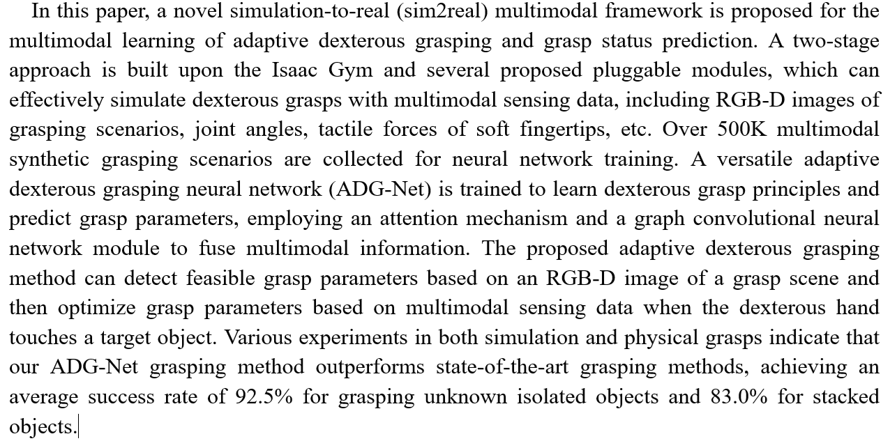
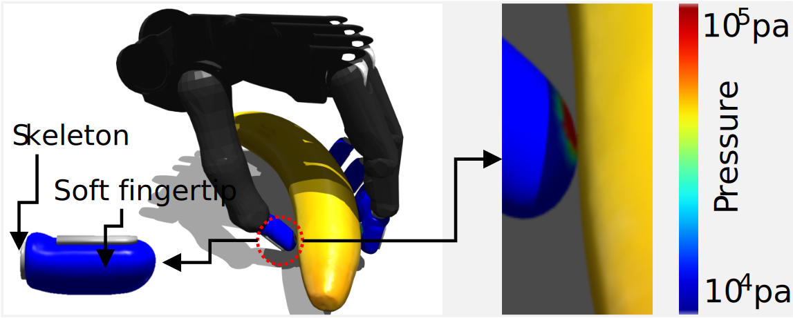
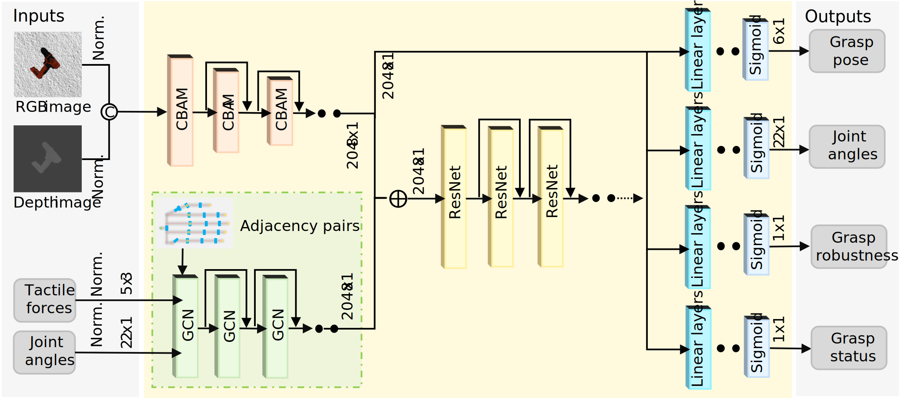
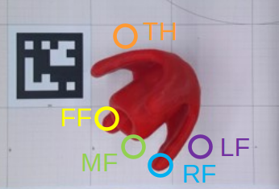
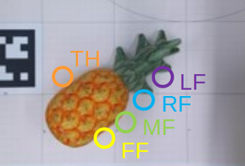
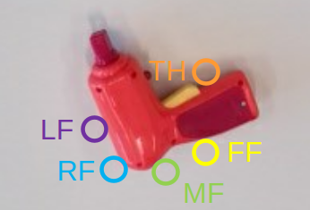
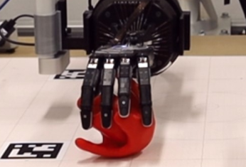
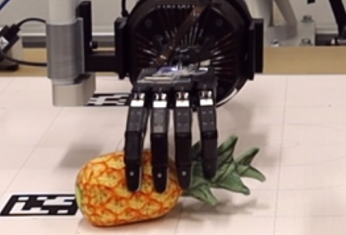
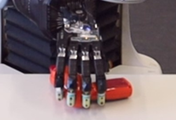

# ADG-Net

## Abstract

## Pipeline of the proposed grasping method with a bio-inspired soft gripper

## Pipeline of a two-stage grasp simulation

## Architecture of the ADG-Net

Note: More details about ADG-Net parameters can be found in `cfg/01_nn_train.yaml`.

# Robotic grasping
Here are four examples of robotic grasping evaluated via the BIG-Net.

        

        

## Extra explanation
1) This repository has been tested on Ubuntu 20.0 (python 3.8).

# Video demo
1. [https://youtu.be/mTenaFlNuNE](https://youtu.be/eEytR1TxfQs)

# Citation
  It will be available soon.

